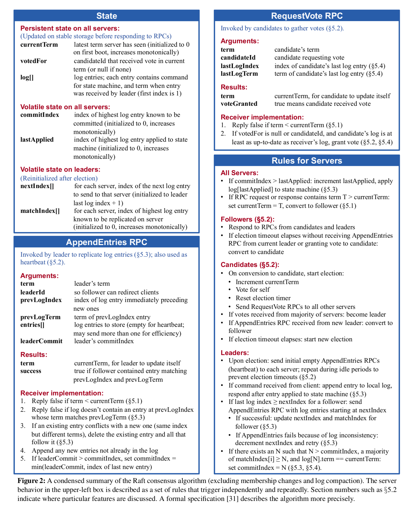

# Raft

This is an implementation of the Raft distributed consensus protocol, providing fault tolerance without sacrificing much performance. The Raft protocol provides an API for users to build an application on incorporating multiple servers.

An visualization for Raft can be found here: https://raft.github.io/

## What is it doing?

At a high-level perspective, Raft provides each server with three different states: Leader, Candidate, and Follower. While Raft is operating normally, where a simple majority of all servers are still running, there is at most one Leader and the rest are Followers. Candidates are Follower servers who have not heard from the Leader for a period of time, and request votes from their peers. If a Candidate obtains a simple majority of the votes, then they are promoted to Leader status. It's during this time, where there is a Leader and majority of servers in contact, that Raft is able to replicate its log from Leader to Followers.

## Design
Each Raft peer has the following state:

```golang
type Raft struct {
	mu        sync.Mutex          // Lock to protect shared access to this peer's state
	peers     []*labrpc.ClientEnd // RPC end points of all peers
	persister *Persister          // Object to hold this peer's persisted state
	me        int                 // this peer's index into peers[]
	dead      int32               // set by Kill()
	applyCh   chan ApplyMsg

	// Persistent state
	currentTerm       int
	votedFor          int // -1 is null/none
	log               []LogEntry
	offsetIndex       int
	lastIncludedIndex int
	lastIncludedTerm  int

	// volatile
	commitIndex int
	lastApplied int
	snapshot    []byte

	// volatile for leaders
	nextIndex  []int
	matchIndex []int

	// election timeout
	electionTimeout time.Time
	isLeader        bool
}
```

Each Raft has the following RPCs to accomplish the distributed consensus' goals:

* InstallSnapshot
* RequestVote
* AppendEntries

as well as functions to send those RPCs:

* sendInstallSnapshot
* sendRequestVote
* sendAppendEntries

For each Raft peer, they have the following functions to maintain the peer:

* persist
* readPersist
* Snapshot
* relaySnapshots
* applyEntries
* updateCommitIndex
* logAgreement
* election
* ticker
* Start
* killed

## RPCs

The RPCs were designed following the guidelines provided by the original Raft paper's Figure 2, where the various types of servers (Followers, Candidates, Leaders) have their specifications listed.




Note: the original template of this codebase is borrowed from [MIT's 6.5840 Distributed Systems course](https://pdos.csail.mit.edu/6.824/).